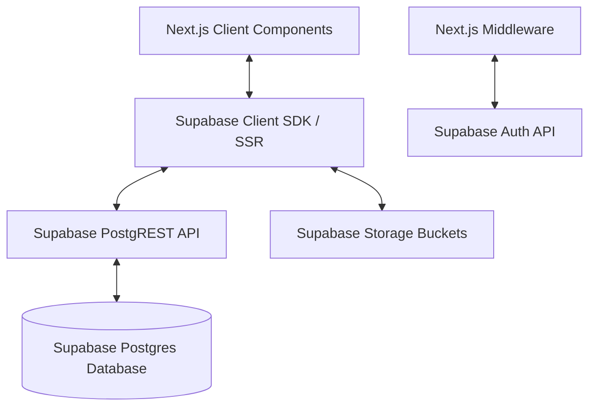

# Nexora — Supabase Backend Implementation Specification

This document provides a production-ready blueprint for transitioning the Nexora platform from localized mock state (`localStorage` and `lib/seeds.ts`) to a production-grade backend powered by **Supabase**.

---

## 0. Implementation Status (as of 2026-08-03)

| Area | Status | Notes |
| :--- | :--- | :--- |
| Postgres schema (§2) | ✅ Live | All 12 original tables + `reconciliation_ledger` (13 total) + enums confirmed against the live DB. Tracked snapshot: `schema.sql` (stale again as of this update — regenerate after further schema changes). |
| RLS + `get_user_role()` (§3) | ✅ Live | Shipped via `supabase/migrations/20260802201854_finalize_backend_spec.sql` and `20260802211022_add_reconciliation_ledger.sql`. RLS enabled on all 13 tables; policies follow the role matrix in §3.1, with `invoices` policies matching §3.3 verbatim. |
| `auth.users` → `profiles` trigger | ✅ Live | `handle_new_user()` + `on_auth_user_created` trigger. Required for §4.1 sign-up to work — without it, new auth users have no `profiles` row. |
| Storage bucket `finops-documents` | ✅ Live | Private (`public: false`), with `storage.objects` policies scoped to the bucket. Actively used by §4.7 document upload/view. |
| §4.1 Login / Sign-up | ✅ Implemented | Real Supabase Auth (`signInWithPassword`, `signUp`). See §4.1 below, including a Next.js-16-specific gotcha (`proxy.ts`, not `middleware.ts`). |
| §4.2 Dashboard | ✅ Implemented | No page code changes needed — it already read exclusively from `FinOpsContext`, which is now Supabase-backed. |
| §4.3 Invoice Processing | ✅ Implemented | Real insert/update/delete against `invoices`, gated by the `vendors` FK (see reference-data seeding below). |
| §4.4 AP Reconciliation | ✅ Implemented | New `reconciliation_ledger` table (schema decision resolved — see §2.12 below); one row per matched (payment, invoice) pair, written on "Approve Recon Run" alongside a real audit log entry. |
| §4.5 Withholding Tax Manager | ✅ Implemented | Real insert/bulk-update against `wht_payments`. The "pending" rows computed from unfiled invoices now look up the vendor's real `tax_id_pin` instead of a randomly generated fake PIN. |
| §4.6 Payroll Automator | ✅ Implemented | Unchanged from the prior pass — `lib/payroll-engine.ts` + `app/api/payroll/route.ts`. All 49 employee records now carry realistic (synthetic, not real-person) Kenyan identity data — see note below. |
| §4.7 Document Store | ✅ Implemented | Real file picker → `finops-documents` Storage upload → `documents` metadata insert. View/Download use `createSignedUrl`. Delete is a soft-delete (`is_deleted` + `deletion_reason`), matching the doc's audit-trail requirement — no hard deletes. |
| §4.8 Audit Trail | ✅ Implemented | No page code changes needed — reads `FinOpsContext.auditTrail`, now backed by real `audit_logs` inserts from every mutating action across the app (vendor, invoice, WHT, checklist, document, reconciliation). |
| `reconciliation_ledger` table | ✅ Resolved | See §2.12 — one row per matched invoice; unmatched payments get a single row with `invoice_id = NULL`. |
| `gl_accounts` / `budgets` / `checklist_items` writes, `/chart-of-accounts`, `/budget`, `/vendors`, `/month-end` pages | ⬜ Out of scope | Not part of §4's page list. `checklist_items` is read-wired (Dashboard depends on it) and seeded with the 15 standard month-end tasks, but its write path (`/month-end`) wasn't touched. `gl_accounts`/`budgets` remain on local mock state. |
| `payroll_constants` table (§4.6 TIP) | ⬜ Not started | Explicitly framed as a future enhancement, not a hard requirement. |
| Employee identity data | ✅ Regenerated | The live import (`scripts/import-employees-to-supabase.js`) could only recover real names for ~10 of 49 employees from the source workbook — the rest had no name/bank data at all, only anonymized staff numbers. All 49 records now have synthetic-but-realistic Kenyan names, national IDs, KRA PINs, SHA/SHIF numbers, and bank details generated for demo purposes; all salary figures are untouched (still the real computed values from the reference workbook). |

---

## 1. System Architecture

The application will transition to a full-stack Next.js App Router application integrated with Supabase:



### Key Technical Specs:
- **Database**: Supabase Postgres with relational integrity (PKs, FKs, Unique constraints).
- **Authentication**: Supabase Auth using corporate emails and secure passwords.
- **Access Control**: Postgres Row Level Security (RLS) referencing a custom user roles table.
- **Storage**: Supabase Storage for invoice files, bank statements, and generated KRA certificates.
- **Timezone**: All database events default to `Africa/Nairobi` (EAT) for KRA compliance tracking.

---

## 2. Supabase Postgres Schema Design

Below is the complete database structure. We will implement these tables in a single schema setup (under the standard `public` schema).

### 2.1 Enums & Types
```sql
CREATE TYPE public.vendor_type AS ENUM ('Supplier', 'Consultant', 'Logistics');
CREATE TYPE public.vat_treatment_type AS ENUM ('Standard (16%)', 'Zero Rated (0%)', 'Exempt');
CREATE TYPE public.wht_type AS ENUM ('2%', '5%', 'Exempt');
CREATE TYPE public.vendor_status AS ENUM ('Active', 'Inactive', 'On Hold');
CREATE TYPE public.invoice_status AS ENUM ('Draft', 'Pending', 'Approved', 'Posted');
CREATE TYPE public.wht_payment_status AS ENUM ('Calculated', 'Filed');
CREATE TYPE public.gl_account_type AS ENUM ('Asset', 'Liability', 'Equity', 'Revenue', 'Cost of Sales', 'Expense');
CREATE TYPE public.checklist_status AS ENUM ('Pending', 'In Progress', 'Complete', 'On Hold');
CREATE TYPE public.doc_tag_type AS ENUM ('invoice', 'po', 'bank statement', 'payroll', 'kra confirmation', 'wht certificate', 'other');
CREATE TYPE public.user_role AS ENUM ('senior_accountant', 'finance_manager', 'production_manager', 'business_controller');
```

### 2.2 Profiles & Roles Table
Maps Supabase Auth users to physical corporate names and structural roles.
```sql
CREATE TABLE public.profiles (
    id UUID PRIMARY KEY REFERENCES auth.users(id) ON DELETE CASCADE,
    email VARCHAR(255) NOT NULL UNIQUE,
    full_name VARCHAR(100) NOT NULL,
    role public.user_role NOT NULL DEFAULT 'senior_accountant',
    created_at TIMESTAMP WITH TIME ZONE DEFAULT timezone('Africa/Nairobi'::text, now())
);
```

### 2.3 Vendors Table
```sql
CREATE TABLE public.vendors (
    vendor_id VARCHAR(50) PRIMARY KEY, -- e.g. "V001"
    name VARCHAR(255) NOT NULL,
    type public.vendor_type NOT NULL DEFAULT 'Supplier',
    tax_id_pin VARCHAR(20) NOT NULL UNIQUE, -- Verified with: P\d{9}[A-Z]
    contact_person VARCHAR(100),
    email VARCHAR(255),
    phone VARCHAR(50),
    bank_account VARCHAR(100),
    vat_treatment public.vat_treatment_type NOT NULL DEFAULT 'Standard (16%)',
    wht_type public.wht_type NOT NULL DEFAULT '2%',
    currency VARCHAR(10) NOT NULL DEFAULT 'KES',
    default_ledger VARCHAR(50) NOT NULL,
    default_department VARCHAR(50) NOT NULL,
    default_cost_centre VARCHAR(50) NOT NULL,
    payment_terms VARCHAR(50) DEFAULT 'Net 30',
    status public.vendor_status NOT NULL DEFAULT 'Active',
    notes TEXT,
    created_at TIMESTAMP WITH TIME ZONE DEFAULT timezone('Africa/Nairobi'::text, now()),
    updated_at TIMESTAMP WITH TIME ZONE DEFAULT timezone('Africa/Nairobi'::text, now())
);
```

### 2.4 Invoices Table
```sql
CREATE TABLE public.invoices (
    id UUID PRIMARY KEY DEFAULT gen_random_uuid(),
    vendor_id VARCHAR(50) NOT NULL REFERENCES public.vendors(vendor_id) ON DELETE RESTRICT,
    vendor_name VARCHAR(255) NOT NULL, -- Cached for performance / audit snapshot
    invoice_number VARCHAR(100) NOT NULL,
    cu_invoice_number VARCHAR(100) NOT NULL, -- iTax Tax Invoice number
    invoice_date DATE NOT NULL,
    due_date DATE NOT NULL,
    subtotal NUMERIC(15, 2) NOT NULL DEFAULT 0.00,
    vat_treatment VARCHAR(50) NOT NULL,
    vat_amount NUMERIC(15, 2) NOT NULL DEFAULT 0.00,
    total NUMERIC(15, 2) NOT NULL DEFAULT 0.00,
    currency VARCHAR(10) NOT NULL DEFAULT 'KES',
    wht_type VARCHAR(20) NOT NULL DEFAULT 'Exempt',
    wht_amount NUMERIC(15, 2) NOT NULL DEFAULT 0.00,
    cost_centre VARCHAR(50) NOT NULL,
    gl_account VARCHAR(50) NOT NULL,
    department VARCHAR(50) NOT NULL,
    approved_by VARCHAR(100),
    approval_date TIMESTAMP WITH TIME ZONE,
    status public.invoice_status NOT NULL DEFAULT 'Draft',
    kra_rate NUMERIC(10, 4) DEFAULT 1.0000,
    created_at TIMESTAMP WITH TIME ZONE DEFAULT timezone('Africa/Nairobi'::text, now()),
    updated_at TIMESTAMP WITH TIME ZONE DEFAULT timezone('Africa/Nairobi'::text, now()),
    CONSTRAINT unique_vendor_invoice UNIQUE (vendor_id, invoice_number)
);
```

### 2.5 Withholding Tax (WHT) Payments Table
```sql
CREATE TABLE public.wht_payments (
    id UUID PRIMARY KEY DEFAULT gen_random_uuid(),
    invoice_id UUID REFERENCES public.invoices(id) ON DELETE SET NULL,
    vendor_name VARCHAR(255) NOT NULL,
    vendor_pin VARCHAR(20) NOT NULL,
    cu_invoice_number VARCHAR(100) NOT NULL,
    invoice_date DATE NOT NULL,
    payment_date DATE NOT NULL,
    gross_amount NUMERIC(15, 2) NOT NULL DEFAULT 0.00,
    wht_rate NUMERIC(5, 4) NOT NULL, -- 0.02 or 0.05
    wht_amount NUMERIC(15, 2) NOT NULL DEFAULT 0.00,
    payment_ref VARCHAR(100) NOT NULL,
    status public.wht_payment_status NOT NULL DEFAULT 'Calculated',
    kra_reference VARCHAR(100),
    created_at TIMESTAMP WITH TIME ZONE DEFAULT timezone('Africa/Nairobi'::text, now()),
    updated_at TIMESTAMP WITH TIME ZONE DEFAULT timezone('Africa/Nairobi'::text, now())
);
```

### 2.6 GL Accounts Table (Chart of Accounts)
```sql
CREATE TABLE public.gl_accounts (
    code VARCHAR(50) PRIMARY KEY, -- e.g. "5000"
    name VARCHAR(255) NOT NULL,
    type public.gl_account_type NOT NULL,
    department VARCHAR(50) NOT NULL,
    cost_centre VARCHAR(50) NOT NULL,
    created_at TIMESTAMP WITH TIME ZONE DEFAULT timezone('Africa/Nairobi'::text, now())
);
```

### 2.7 Employees Table (Kenyan Payroll Master Profile)
```sql
CREATE TABLE public.employees (
    id VARCHAR(50) PRIMARY KEY, -- Staff No, e.g. "1000"
    name VARCHAR(255) NOT NULL,
    national_id VARCHAR(20) NOT NULL UNIQUE, -- Kenya National ID Number
    kra_pin VARCHAR(20) NOT NULL UNIQUE, -- KRA PIN (e.g. A000000000Z)
    sha_pin VARCHAR(30), -- Social Health Authority (SHA) PIN / SHIF registration identifier
    grade VARCHAR(50) NOT NULL,
    cost_centre VARCHAR(50) NOT NULL,
    department VARCHAR(50) NOT NULL,
    bank_name VARCHAR(100) NOT NULL, -- Bank name for salary transfer
    bank_account_number VARCHAR(100) NOT NULL, -- Bank account number
    base_salary NUMERIC(15, 2) NOT NULL DEFAULT 0.00,
    bonus_commission NUMERIC(15, 2) NOT NULL DEFAULT 0.00,
    fringe_benefit NUMERIC(15, 2) NOT NULL DEFAULT 0.00,
    transport_allowance NUMERIC(15, 2) NOT NULL DEFAULT 0.00,
    arrears NUMERIC(15, 2) NOT NULL DEFAULT 0.00,
    ot_other NUMERIC(15, 2) NOT NULL DEFAULT 0.00,
    voluntary_pension NUMERIC(15, 2) NOT NULL DEFAULT 0.00,
    advances NUMERIC(15, 2) NOT NULL DEFAULT 0.00, -- Salary Advance
    helb NUMERIC(15, 2) NOT NULL DEFAULT 0.00,
    company_loan NUMERIC(15, 2) NOT NULL DEFAULT 0.00,
    bank_loan NUMERIC(15, 2) NOT NULL DEFAULT 0.00,
    sacco NUMERIC(15, 2) NOT NULL DEFAULT 0.00,
    created_at TIMESTAMP WITH TIME ZONE DEFAULT timezone('Africa/Nairobi'::text, now()),
    updated_at TIMESTAMP WITH TIME ZONE DEFAULT timezone('Africa/Nairobi'::text, now())
);
```

### 2.7b Payroll Runs & Register Entries Tables
Tracks the historical execution of payroll on a monthly basis, storing all calculation outputs (matching columns of Sheet 2).
```sql
-- Types for payroll runs
CREATE TYPE public.payroll_run_status AS ENUM ('Draft', 'Approved', 'Posted');

-- Payroll runs ledger table (tracks specific monthly close execution)
CREATE TABLE public.payroll_runs (
    id UUID PRIMARY KEY DEFAULT gen_random_uuid(),
    month VARCHAR(7) NOT NULL UNIQUE, -- format "YYYY-MM" (e.g. "2026-07")
    status public.payroll_run_status NOT NULL DEFAULT 'Draft',
    processed_by UUID REFERENCES public.profiles(id) ON DELETE RESTRICT,
    approved_by UUID REFERENCES public.profiles(id) ON DELETE RESTRICT,
    created_at TIMESTAMP WITH TIME ZONE DEFAULT timezone('Africa/Nairobi'::text, now()),
    updated_at TIMESTAMP WITH TIME ZONE DEFAULT timezone('Africa/Nairobi'::text, now())
);

-- Payroll Register Entries (stores specific employee calculations for a specific run month, matching Sheet 2)
CREATE TABLE public.payroll_register_entries (
    id UUID PRIMARY KEY DEFAULT gen_random_uuid(),
    payroll_run_id UUID NOT NULL REFERENCES public.payroll_runs(id) ON DELETE CASCADE,
    employee_id VARCHAR(50) NOT NULL REFERENCES public.employees(id) ON DELETE RESTRICT,
    
    -- Inputs at run-time
    basic_salary NUMERIC(15, 2) NOT NULL DEFAULT 0.00,
    bonus_commission NUMERIC(15, 2) NOT NULL DEFAULT 0.00,
    fringe_benefit NUMERIC(15, 2) NOT NULL DEFAULT 0.00,
    transport_allowance NUMERIC(15, 2) NOT NULL DEFAULT 0.00,
    arrears NUMERIC(15, 2) NOT NULL DEFAULT 0.00,
    ot_other NUMERIC(15, 2) NOT NULL DEFAULT 0.00,
    voluntary_pension NUMERIC(15, 2) NOT NULL DEFAULT 0.00,
    advances NUMERIC(15, 2) NOT NULL DEFAULT 0.00, -- Salary Advance
    helb NUMERIC(15, 2) NOT NULL DEFAULT 0.00,
    company_loan NUMERIC(15, 2) NOT NULL DEFAULT 0.00,
    bank_loan NUMERIC(15, 2) NOT NULL DEFAULT 0.00,
    sacco NUMERIC(15, 2) NOT NULL DEFAULT 0.00,
    
    -- Calculated outputs at run-time (Sheet 2 columns)
    gross_salary NUMERIC(15, 2) NOT NULL DEFAULT 0.00,
    nssf_t1 NUMERIC(15, 2) NOT NULL DEFAULT 420.00,
    nssf_t2 NUMERIC(15, 2) NOT NULL DEFAULT 1740.00,
    shif NUMERIC(15, 2) NOT NULL DEFAULT 0.00,
    ahl NUMERIC(15, 2) NOT NULL DEFAULT 0.00,
    defined_pension_ee NUMERIC(15, 2) NOT NULL DEFAULT 0.00,
    taxable_pay NUMERIC(15, 2) NOT NULL DEFAULT 0.00,
    gross_paye NUMERIC(15, 2) NOT NULL DEFAULT 0.00,
    personal_relief NUMERIC(15, 2) NOT NULL DEFAULT 2400.00,
    nhif_relief NUMERIC(15, 2) NOT NULL DEFAULT 0.00,
    ahl_relief NUMERIC(15, 2) NOT NULL DEFAULT 0.00,
    net_paye NUMERIC(15, 2) NOT NULL DEFAULT 0.00,
    total_deductions NUMERIC(15, 2) NOT NULL DEFAULT 0.00,
    net_pay NUMERIC(15, 2) NOT NULL DEFAULT 0.00,
    employer_pension NUMERIC(15, 2) NOT NULL DEFAULT 0.00,
    nita NUMERIC(15, 2) NOT NULL DEFAULT 50.00,
    
    created_at TIMESTAMP WITH TIME ZONE DEFAULT timezone('Africa/Nairobi'::text, now()),
    CONSTRAINT unique_run_employee UNIQUE (payroll_run_id, employee_id)
);
```

### 2.8 Month-End Checklist Table
```sql
CREATE TABLE public.checklist_items (
    id VARCHAR(50) PRIMARY KEY, -- e.g. "AP-01"
    task TEXT NOT NULL,
    assigned_to VARCHAR(100) NOT NULL,
    status public.checklist_status NOT NULL DEFAULT 'Pending',
    completed_date DATE,
    approver VARCHAR(100),
    created_at TIMESTAMP WITH TIME ZONE DEFAULT timezone('Africa/Nairobi'::text, now()),
    updated_at TIMESTAMP WITH TIME ZONE DEFAULT timezone('Africa/Nairobi'::text, now())
);
```

### 2.9 Budgets Table
```sql
CREATE TABLE public.budgets (
    id UUID PRIMARY KEY DEFAULT gen_random_uuid(),
    cost_centre VARCHAR(50) NOT NULL,
    gl_account VARCHAR(50) NOT NULL,
    month VARCHAR(7) NOT NULL, -- format "YYYY-MM"
    budget_amount NUMERIC(15, 2) NOT NULL DEFAULT 0.00,
    actual_amount NUMERIC(15, 2) NOT NULL DEFAULT 0.00,
    created_at TIMESTAMP WITH TIME ZONE DEFAULT timezone('Africa/Nairobi'::text, now()),
    updated_at TIMESTAMP WITH TIME ZONE DEFAULT timezone('Africa/Nairobi'::text, now()),
    CONSTRAINT unique_budget_cc_gl_month UNIQUE (cost_centre, gl_account, month)
);
```

### 2.10 Documents Table
```sql
CREATE TABLE public.documents (
    id UUID PRIMARY KEY DEFAULT gen_random_uuid(),
    name VARCHAR(255) NOT NULL,
    tag public.doc_tag_type NOT NULL,
    storage_path TEXT NOT NULL, -- Reference to the file in Supabase Storage Bucket
    size INTEGER NOT NULL,
    uploaded_at TIMESTAMP WITH TIME ZONE DEFAULT timezone('Africa/Nairobi'::text, now()),
    uploaded_by VARCHAR(100) NOT NULL,
    is_deleted BOOLEAN NOT NULL DEFAULT FALSE,
    deletion_reason TEXT
);
```

### 2.11 Audit Log Table (Immutable Ledger)
```sql
CREATE TABLE public.audit_logs (
    id VARCHAR(50) PRIMARY KEY, -- Format: "AUD-XXXXXX"
    timestamp TIMESTAMP WITH TIME ZONE DEFAULT timezone('Africa/Nairobi'::text, now()),
    operator_user VARCHAR(100) NOT NULL,
    action VARCHAR(100) NOT NULL,
    document_ref VARCHAR(150),
    details TEXT,
    amount NUMERIC(15, 2)
);
```

### 2.12 Reconciliation Ledger Table
> Referenced in §4.4 (AP Reconciliation) but never given a column definition anywhere in the original spec. Schema resolved and shipped via `supabase/migrations/20260802211022_add_reconciliation_ledger.sql`. One row per matched (payment, invoice) pair — a multi-invoice match produces multiple rows sharing the same `payment_ref`; an unmatched payment gets a single row with `invoice_id = NULL`.
```sql
CREATE TABLE public.reconciliation_ledger (
    id UUID PRIMARY KEY DEFAULT gen_random_uuid(),
    payment_ref VARCHAR(100) NOT NULL,
    vendor_name VARCHAR(255) NOT NULL,
    payment_amount_kes NUMERIC(15, 2) NOT NULL,
    payment_date DATE NOT NULL,
    invoice_id UUID REFERENCES public.invoices(id) ON DELETE SET NULL,
    match_status VARCHAR(30) NOT NULL, -- 'Matched' | 'Unmatched' | 'Multi-Invoice Match'
    confidence VARCHAR(50),
    approved_by VARCHAR(100) NOT NULL,
    approved_at TIMESTAMP WITH TIME ZONE DEFAULT timezone('Africa/Nairobi'::text, now()),
    created_at TIMESTAMP WITH TIME ZONE DEFAULT timezone('Africa/Nairobi'::text, now())
);
```

---

## 3. Authentication & Row Level Security (RLS)

> **Status: implemented.** RLS is enabled on all 13 tables and `get_user_role()` exists on the live database — see `supabase/migrations/20260802201854_finalize_backend_spec.sql` and `20260802211022_add_reconciliation_ledger.sql` for the exact policies shipped (they extend the role matrix below to every table, not just `invoices`). One caveat carried over from this spec: the "only `finance_manager` can approve" policy on `invoices` (§3.3) and the broad "all accountants can write" policy are both permissive policies evaluated with OR semantics in Postgres, so a `senior_accountant` is not actually blocked from flipping `status` to `Approved` by RLS alone — enforcing that specific column-level restriction would need a trigger or a check constraint, not row-level policies.

Supabase Row Level Security will enforce role-based access control directly in Postgres:

### 3.1 Role Mapping Matrix

| Role (`user_role`) | Operations Allowed | Tables Access |
| :--- | :--- | :--- |
| `senior_accountant` (Mercy) | Full Write, Calculate WHT, Prepare Payroll | `vendors`, `invoices`, `wht_payments`, `employees`, `checklist_items`, `audit_logs`, `documents` |
| `finance_manager` (Tony) | Invoice Approvals, AP Recon Approvals, Checklist Locking | All Tables (Full Read/Write) |
| `production_manager` (Harrison)| View Cost Centre Budgets, Submit POs/Delivery Notes | READ ONLY: `budgets`, `vendors` \| WRITE: `documents` |
| `business_controller` (Charles)| Global Read-Only Audits, Export Reports | READ ONLY: All tables |

### 3.2 SQL Helper Function for Role Extraction
```sql
CREATE OR REPLACE FUNCTION public.get_user_role()
RETURNS public.user_role AS $$
  SELECT role FROM public.profiles WHERE id = auth.uid();
$$ LANGUAGE sql SECURITY DEFINER;
```

### 3.3 Example RLS Security Policies
Applying RLS to the `invoices` table:
```sql
-- Enable Row Level Security
ALTER TABLE public.invoices ENABLE ROW LEVEL SECURITY;

-- 1. All corporate users can READ invoices
CREATE POLICY "Allow authenticated read access"
ON public.invoices FOR SELECT
TO authenticated
USING (true);

-- 2. Senior Accountant and Finance Manager can INSERT/UPDATE drafts and pending invoices
CREATE POLICY "Allow invoice management for accountants"
ON public.invoices FOR ALL
TO authenticated
USING (public.get_user_role() IN ('senior_accountant', 'finance_manager'))
WITH CHECK (public.get_user_role() IN ('senior_accountant', 'finance_manager'));

-- 3. Only Finance Manager can approve / change status to Approved or Posted
CREATE POLICY "Allow status approval by finance manager only"
ON public.invoices FOR UPDATE
TO authenticated
USING (
    public.get_user_role() = 'finance_manager'
);
```

---

## 4. Page-by-Page Migration Specifications

Here is the exact page-by-page mapping mapping state transformations from mock frontend to Supabase API calls.

### 4.1 Login / Initial Portal (`/sign-in` & `/sign-up`)
> **Status: implemented.**
- **Sign-in** (`app/sign-in/page.tsx`): Calls `supabase.auth.signInWithPassword({ email, password })` via the browser client (`lib/supabase.ts` → `createSupabaseBrowserClient`). On success, queries `profiles` for `full_name`/`role`/`email` and stores them in `FinOpsContext` via `applyAuthProfile()`. Auth and profile-lookup failures both surface a visible inline error banner.
- **Sign-up** (`app/sign-up/page.tsx`): Calls `supabase.auth.signUp({ email, password, options: { data: { full_name, role } } })`. The `full_name`/`role` land in `raw_user_meta_data`, which the `handle_new_user()` trigger reads to populate the new `profiles` row automatically (defaults to `senior_accountant` if `role` is missing). This project has **email confirmation enabled** (confirmed by testing directly against the live project), so `signUp()` does not return a session immediately — the page detects `!data.session` and shows a "check your email" screen instead of redirecting to `/dashboard`.
- **Session state**: `components/finops-provider.tsx` hydrates `currentUser`/`currentUserRole`/`currentUserEmail` from the existing Supabase session on mount (`getSession()` + a `profiles` lookup) and stays in sync via `onAuthStateChange`, so a page refresh doesn't lose identity. `signOut()` calls `supabase.auth.signOut()` and clears local state.
- **Route protection**: unauthenticated access to any workspace route redirects to `/sign-in`; an authenticated session on `/sign-in` or `/sign-up` redirects to `/dashboard`.
  - **Next.js-16-specific gotcha**: this project's Next.js build has renamed `middleware.ts` → `proxy.ts` (exported function must be named `proxy`, not `middleware` — see `node_modules/next/dist/docs/01-app/01-getting-started/16-proxy.md`). The route-protection logic lives in `proxy.ts` at the repo root, not `middleware.ts`. Using the old convention silently fails at runtime (`Could not parse module 'middleware.ts', file not found`).
- **Removed as a consequence**: the previous UI had a free "switch to any operator" dropdown (Mercy/Tony/Harrison/Charles) in the workspace sidebar, which let anyone impersonate any role without credentials. That's incompatible with real auth and has been replaced with a read-only display of the authenticated operator's name/role and a real sign-out button.
- Verified end-to-end against the live Supabase project: sign-up → `handle_new_user()` trigger → `profiles` row created → sign-in → RLS-gated self-read of `profiles` → `get_user_role()` all resolve correctly.

### 4.2 Dashboard (`/dashboard`)
> **Status: implemented.** No changes were needed to `app/(workspace)/dashboard/page.tsx` itself — it already read exclusively from `useFinOps()` (`invoices`, `whtPayments`, `checklist`, `auditTrail`, `vendors`), and that context is now Supabase-backed. All KPI calculations (`Total Invoices Processed`, `Outstanding WHT`, `Days until iTax Filing Deadline`, checklist completion %) now run over real rows.

### 4.3 Invoice Processing (`/invoice`)
> **Status: implemented** (file-attachment upload deferred — see below).
- No changes needed to the page itself — it already routed all reads/writes through `useFinOps()`.
- `components/finops-provider.tsx`'s `addInvoice`/`updateInvoice`/`deleteInvoice` now perform real `invoices` table inserts/updates/deletes. Insert lets Postgres generate the row's UUID (`gen_random_uuid()`) rather than the client-generated temp ID; the temp ID is swapped for the real one once the insert resolves.
- `validateInvoice` (`lib/api-logic.ts`) already existed as a pure client-side function and needed no changes.
- The `vendors` table is a hard FK dependency (`invoices.vendor_id REFERENCES vendors`) — it was empty in the live DB, so the 5 reference vendors from the original mock were seeded in via a one-off script before this could work at all.
- **Not implemented**: actual PDF/file upload for the invoice document itself (the page has no file input — it's an OCR-simulation preset picker). Only the invoice *record* is real; attaching the source file to Storage would need the same file-picker treatment given to Document Store (§4.7).

### 4.4 AP Reconciliation (`/ap-reconciliation`)
> **Status: implemented.**
- Bank payments remain a local, in-page mock array (`useState`) — no bank-feed/bank-statement table exists in the schema, and the spec doesn't define one either.
- `runAPReconciliation(payments, approvedInvoices)` (`lib/api-logic.ts`) is unchanged — a pure function over the real `invoices` list.
- **Reconciliation Approval**: `approveReconciliation()` in the page now inserts one row per matched (payment, invoice) pair into the new `reconciliation_ledger` table (see §2.12 — this table didn't exist anywhere in the original spec and had to be designed from the §4.4 description), then calls `addAuditLog(...)`, which persists to `audit_logs`.

### 4.5 Withholding Tax Manager (`/wht-calculator`)
> **Status: implemented.**
- No page-level changes needed for reads — `whtPayments`/`invoices` come from `useFinOps()`.
- `fileWhtPayments(ids, kraRef)` performs the real bulk `.update({ status: 'Filed', kra_reference }).in('id', ids)` against `wht_payments`. The "pending" rows synthesized client-side from unfiled invoices are excluded from this DB call (they have no row yet) and are filtered out by an ID-prefix check (`WHT-COMP-`).
- Fixed in passing: the pending-invoice preview rows previously showed a **randomly generated fake vendor PIN** (`Math.random()`) instead of the vendor's real `tax_id_pin` — now looked up from the real `vendors` list by `vendor_id`.

### 4.6 Payroll Automator (`/payroll`)
- **Current Mock Flow**: Loads static seed employee list, calculates PAYE on client calculations.
- **Supabase Integration**:
  - **Fetch Employee Master**: Query active corporate employee structures from `public.employees`.
  - **Process Monthly Run**: When an operator initiates a payroll calculation for the month, insert a transaction header in `public.payroll_runs` (e.g. `month = '2026-07'`).
  - **Compute and Save Entries**: Execute the statutory calculation engine for all active employees and save the inputs and calculated output columns (Gross Salary, Taxable Pay, PAYE, SHIF, AHL, Reliefs, Deductions, Net Pay, Employer Pension, and NITA) as rows in `public.payroll_register_entries` linked to the current `payroll_run_id`. This replicates the exact register logic of **Sheet 2** in a relational database.
  - **Payroll Adjustments**: Read and update employee run-specific variable values (salary advances, ot_other, base_salary adjustments) in `public.payroll_register_entries`.
  - **AX GL Postings Export**: Query the aggregate values from `public.payroll_register_entries` grouped by cost centre to build the General Ledger posting voucher (matching Sheet 2's cost-centre breakdown structure).

#### 2024 Kenyan Statutory Constants for Payroll Calculations
To ensure compliance with the Kenya Revenue Authority (KRA), the backend calculator and database calculations will enforce the following 2024 statutory constants:

1. **NSSF (National Social Security Fund) - Tier-Based EE & ER**:
   - **NSSF Tier I**: KES `420.00` per month (Employee and Employer matching)
   - **NSSF Tier II**: KES `1,740.00` per month (Employee and Employer matching)
   - *Total Standard NSSF (Tier I + Tier II)*: KES `2,160.00` per month.
2. **SHIF (Social Health Insurance Fund)**:
   - Rate: `2.75%` (`0.0275`) of gross salary.
3. **AHL (Affordable Housing Levy)**:
   - Rate: `1.5%` (`0.015`) of gross salary.
   - AHL Relief: `15%` of the AHL amount qualifies as a tax relief reduction against PAYE tax.
4. **Personal Relief**:
   - Monthly Personal Relief: KES `2,400.00` per month.
5. **NITA (National Industrial Training Authority) Levy**:
   - Employer contribution: KES `50.00` flat per employee per month.
6. **2024 KRA PAYE Graduated Monthly Tax Brackets**:
   - **Band 1**: First KES `24,000` (KES 0 – 24,000) taxed at **10%** (Max tax: KES `2,400.00`)
   - **Band 2**: Next KES `8,333` (KES 24,001 – 32,333) taxed at **25%** (Max tax: KES `2,083.25`)
   - **Band 3**: Next KES `467,667` (KES 32,334 – 500,000) taxed at **30%** (Max tax: KES `140,299.80`)
   - **Band 4**: Next KES `300,000` (KES 500,001 – 800,000) taxed at **32.5%** (Max tax: KES `97,499.68`)
   - **Band 5**: Amount above KES `800,000` taxed at **35%**

> [!TIP]
> **Database-Driven Constants configuration**
> In the production implementation, these values should be loaded from a `public.payroll_constants` table rather than hardcoded in the codebase, enabling effortless updates when KRA introduces new slabs or rate adjustments.

### 4.7 Document Store (`/document-store`)
> **Status: implemented.**
- The page previously had no real file input at all — "upload" just typed a filename string. It now has an actual `<input type="file">`; `uploadDocument(file, tag, displayName?)` uploads the binary to the `finops-documents` bucket, then inserts the `documents` metadata row (`name`, `tag`, `storage_path`, `size` in bytes, `uploaded_by`). The in-app `size` field is formatted to a human string (`"420 KB"`) at read time from the real byte count.
- View/Download both call `supabase.storage.from('finops-documents').createSignedUrl(path, 60)` and open the result — previously both buttons just showed a placeholder `alert()`.
- Delete sets `is_deleted = true` + `deletion_reason`, exactly as specified — no hard delete, no physical bucket removal.

### 4.8 Audit Trail (`/audit-trail`)
> **Status: implemented.** No page-level changes needed — it already read exclusively from `useFinOps().auditTrail`. That list is now populated by `supabase.from('audit_logs').select('*').order('timestamp', { ascending: false })` on load, and every mutating action across the app (vendor, invoice, WHT, checklist, document, reconciliation) calls the shared `addAuditLog()`, which inserts a real row (mapping the app-facing `user` field to the DB's `operator_user` column) in addition to updating local state optimistically. The optional "automatic DB trigger to capture insertions/deletions" idea from the original spec was not implemented — audit entries are still written explicitly by application code, not by a Postgres trigger.

---

## 5. Setup & Environment Configurations

The application will leverage `.env.local` variables to initialize connection bindings:

### 5.1 Environment Variables
```env
NEXT_PUBLIC_SUPABASE_URL=<your-project-url>
NEXT_PUBLIC_SUPABASE_PUBLISHABLE_KEY=<your-publishable-key>
SERVICE_ROLE_KEY=<your-service-role-key>
DATABASE_URL=<your-database-connection-string>
```

### 5.2 Next.js Supabase Client Factories (as actually implemented)

The spec originally called for a single `lib/supabase.ts` with `createClient`/`createServer`. The implementation instead splits by privilege level across two files, plus a third client inline in `proxy.ts`:

- **`lib/supabase.ts`** — `createSupabaseBrowserClient()` (anon key, browser-side, session-persisting) and `createSupabaseServerClient()` (anon key, async, cookie-based via `next/headers` — for Server Components / Route Handlers that need to read the current user's session). Both return `null` if env vars are missing, so callers must handle the null case rather than assume the backend is configured.
- **`lib/supabase-server.ts`** — `createSupabaseAdminClient()`, a service-role client (bypasses RLS). Used server-side only, e.g. `app/api/payroll/route.ts`.
- **`proxy.ts`** (repo root) — a third, request-scoped client built inline with `createServerClient` against `NextRequest`/`NextResponse` cookies (the Server Component cookie adapter above doesn't work in Proxy — different runtime, different cookie API). Calls `supabase.auth.getUser()` to decide route-protection redirects. Per Next.js's own guidance, this is an *optimistic* check only — the real authorization boundary is Postgres RLS (§3), not this redirect.

```typescript
// lib/supabase.ts
import { createBrowserClient, createServerClient } from "@supabase/ssr"

export function createSupabaseBrowserClient() {
  if (!process.env.NEXT_PUBLIC_SUPABASE_URL || !process.env.NEXT_PUBLIC_SUPABASE_PUBLISHABLE_KEY) return null
  return createBrowserClient(
    process.env.NEXT_PUBLIC_SUPABASE_URL,
    process.env.NEXT_PUBLIC_SUPABASE_PUBLISHABLE_KEY
  )
}

export async function createSupabaseServerClient() {
  if (!process.env.NEXT_PUBLIC_SUPABASE_URL || !process.env.NEXT_PUBLIC_SUPABASE_PUBLISHABLE_KEY) return null
  const { cookies } = await import("next/headers")
  const cookieStore = await cookies()
  return createServerClient(
    process.env.NEXT_PUBLIC_SUPABASE_URL,
    process.env.NEXT_PUBLIC_SUPABASE_PUBLISHABLE_KEY,
    {
      cookies: {
        getAll: () => cookieStore.getAll(),
        setAll: (cookiesToSet) => {
          try {
            cookiesToSet.forEach(({ name, value, options }) => cookieStore.set(name, value, options))
          } catch {
            // Server Components can't write cookies — proxy.ts owns session refresh instead.
          }
        },
      },
    }
  )
}
```

---

## 6. Implementation Stages & Next Steps

1. ~~**Schema Execution**: Connect to Supabase project SQL Editor and run the schema setup queries.~~ ✅ Done — schema confirmed live, RLS/functions/trigger/storage bucket/`reconciliation_ledger` all added via migration.
2. **Mock Data Migration**: `scripts/import-employees-to-supabase.js` covers `employees` (all 49 rows now carry regenerated realistic identity data — salary figures untouched). Reference/master data for `vendors` (5) and `checklist_items` (15) has been seeded directly into the live DB — required as an FK prerequisite for `invoices` to work at all, since `vendors` was empty. `gl_accounts`/`budgets` remain unseeded (out of scope — no page in this pass reads them from Supabase). `invoices`/`wht_payments`/`documents`/`audit_logs` are intentionally left empty — they're transactional records meant to be created through real usage, not pre-seeded fake history.
3. ~~**Setup Supabase Providers**~~ ✅ Done — all of §4.1–4.8 except the two explicitly-out-of-scope items below are now wired to Supabase through `components/finops-provider.tsx` and page-level calls.
4. **Remaining, explicitly out of scope for this pass**:
   - `reconciliation_ledger`'s schema decision is resolved (§2.12) — no longer open.
   - `payroll_constants` (§4.6 TIP) — still a deferred future enhancement, not required.
   - Invoice file-attachment upload (§4.3) — the invoice *record* is real, but the source PDF/file itself isn't attached to Storage; would need the same file-picker treatment as §4.7.
   - `gl_accounts`, `budgets` writes, and the `/chart-of-accounts`, `/budget`, `/vendors`, `/month-end` pages — never part of §4's page list, still on local mock state (though `vendors` and `checklist_items` are now real for the pages that read them).
